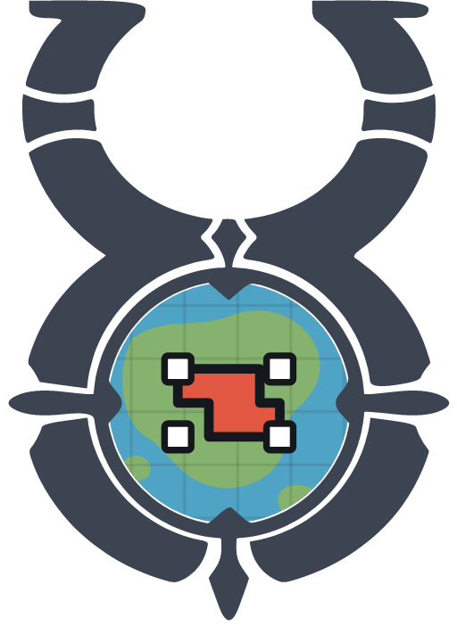
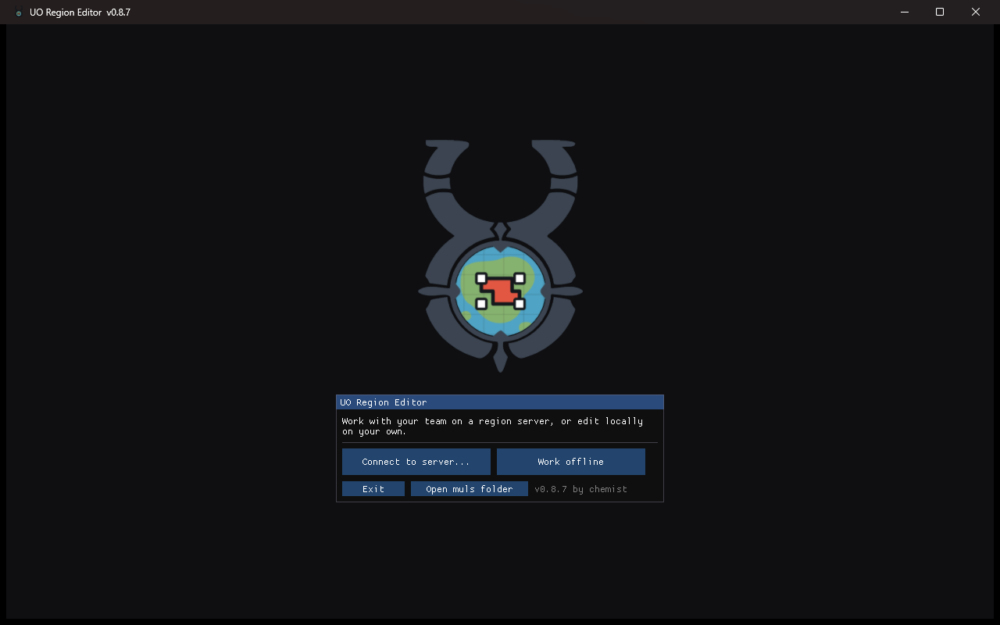
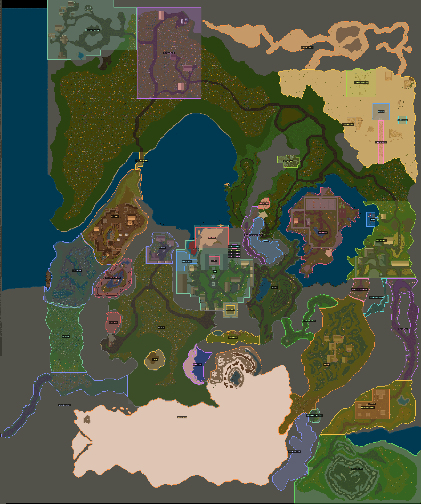

<p align="center">
  
</p>

<h1 align="center">UORegionEditor</h1>

<p align="center"><b>Visual region editor for custom UO maps.</b></p>

<p align="center">
  <a href="https://discord.gg/kU7QeW5XMK"></a>
</p>

Draw regions straight on the world map and export them as **Sphere** `AREADEF`/`ROOMDEF`,
**CentrED** `cedserver.xml`, **ServUO** `Regions.xml` or **ModernUO** `regions.json` — the
exclusive/inclusive edge conventions are handled for you.

<p align="center">
  
</p>

## Download

Two builds of the same app — take whichever suits you:

| | |
| --- | --- |
| **standalone** | one exe, nothing to install |
| **dotnet10** | small download, needs the [.NET 10 Desktop Runtime](https://dotnet.microsoft.com/download/dotnet/10.0) |

Unzip and run `UORegionEditor.exe`. Point it at your shard's muls (**File > Muls...**), or
connect to a region server and it downloads them for you. The map render is cached, so
later starts are instant.

Build from source with `dotnet build -c Release` (.NET 10 SDK), or `build-release.ps1`
to produce both zips.

## Tools

| | |
| --- | --- |
| **Select** `F1` | drag boxes, resize with the handles, arrows nudge (Shift = 8), `Del` removes |
| **Draw box** `F2` | drag a rectangle, or click two opposite corners |
| **Lasso** `F3` · **Brush** `F4` | freehand areas |
| **Quick select** `F5` | click fills every connected matching tile — by colour, or by **Tile type** (its tiledata name), so one click takes a whole cave. Drag to limit the radius. **Fill gaps** takes the clearings inside the selection too, so a forest comes out solid instead of full of grass holes |
| **4 corners** `F6` | click corners, `Enter` finishes |
| `F7`–`F10` | the same four as erasers |

Every tool follows the Z filter: lower Max Z to see inside a mountain and quick select
takes the cave floor, not the roof above it. **Don't overlap other regions** makes the add
tools stop at the edge of other visible regions. **Add to selected region** keeps adding
boxes to one region instead of starting a new one each time.

WASD pans, the wheel zooms, `Esc` cancels — pressed again it clears the selection.
Everything is undoable (`Ctrl+Z` / `Ctrl+Y`, or the History window).

## Export

- **Sphere `.scp`** — right/bottom edges written exclusive (+1), as Sphere expects
- **CentrED xml** and **Merge cedserver...** — inclusive edges; merging replaces same-name
  regions and preserves the rest, with a timestamped `.bak` (stop the CentrED server first)
- **ServUO `Regions.xml`** — region class, priority and music
- **ModernUO `regions.json`** — same fields; edges written exclusive, as ModernUO expects
- **Map image (PNG)** — a shareable player map: every visible region as one silhouette in
  its own colour, with labels

<p align="center">
  
</p>

Import reads all four back in, so moving a shard from one server to another is an import
and an export.

**Editing for** picks the server your shard runs, and the region panel then asks only for
that server's fields — Sphere events, flags and groups, or a region class, priority and
music for ServUO/ModernUO. It sits in the connect dialog (saved per profile) and in
**Options** for offline work, and marks its format in the Import/Export menus. Every
format stays available whichever you pick.

## Why it exists

| Target | Right/bottom edge | The tool |
| --- | --- | --- |
| Sphere `RECT=x1,y1,x2,y2,0` | **exclusive** | +1 on export, −1 on import |
| CentrED `<Rect x1.. y2..>` | **inclusive** | written as-is |

Internally everything is inclusive tiles, so what you see highlighted is exactly what the
region covers.

## Region server

`UORegionServer.exe` shares one region list with your team. First run asks for the port,
muls folder, map size (detected from the map file) and the owner account.

Startup prints one line — `muls: 10 files, 1.2 GB - complete`. `check` shows the detail:

```
  [x] map0LegacyMUL.uop         85 MB  terrain
  [ ] statics0.mul             MISSING  buildings, trees, roads
  [-] optional: artLegacyMUL.uop, MainMisc.uop, hues.mul, texmaps.mul, texidx.mul
```

Required: the map file, `radarcol.mul`, `staidx0.mul`, `statics0.mul`. Optional:
`tiledata.mul` for Tile type mode, and the art files for the isometric view. The server
hands them all to clients, so the whole team renders the same world.

Commands: `adduser`, `passwd`, `setaccess`, `users`, `mapsize`, `check`, `logs`, `export`.
Regions persist to `regions.json` with `.bak` rotation, and every change also writes
`regions.scp`, `regions.centred.xml` and `regions.servuo.xml`.

In the editor, **Connect to server...**: everyone sees each other's edits live and can jump
to a teammate's view, and if the connection drops you keep working locally.

## Selftest

`UORegionEditor.exe --selftest report.txt` runs ~100 headless checks — coordinate
conversions, script round-trips, region maths, server sync and map rendering.

## Credits

- **[ClassicUO](https://github.com/ClassicUO/ClassicUO)** — andreakarasho and contributors;
  its loaders read the art, tiledata and hues for the isometric view.
- **[CentrED#](https://github.com/kaczy93/centredsharp)** — Kaczy and contributors, and
  Andreas Schneider for the original CentrED, whose design informed a lot of this one.
- **[ServUO](https://github.com/ServUO/ServUO)** — Voxpire and the ServUO team, whose
  `Data/Regions.xml` format the ServUO export follows.
- **[Source-X](https://github.com/Sphereserver/Source-X)** — where the exact `AREADEF`
  parsing rules behind the exports were verified.
- **False** — testing and feedback.

## Disclaimer

An unofficial fan-made tool, not affiliated with, endorsed by or sponsored by Electronic
Arts Inc. or Broadsword Online Games. *Ultima Online* is a trademark of Electronic Arts Inc.

No Ultima Online client data is included here or in the releases — you supply your own muls.
